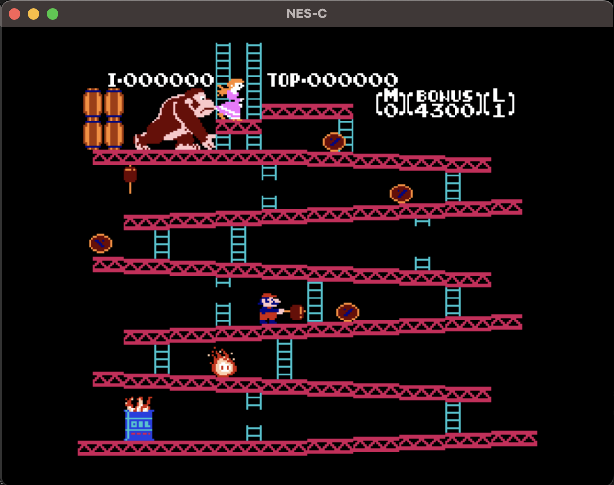

# NES-C

A cycle-accurate NES Emulator built for fun (and education)!

## Goals

- Improve general understanding of computer architecture.
- Play old ROM games i have on my hard drive.

## TODO

* Implement PPU sprite evaluation
* Implement APU emulation

## License

Code and documentation Copyright (c) 2023 Keith Leonardo

Code released under the [MIT License](https://choosealicense.com/licenses/mit/).
